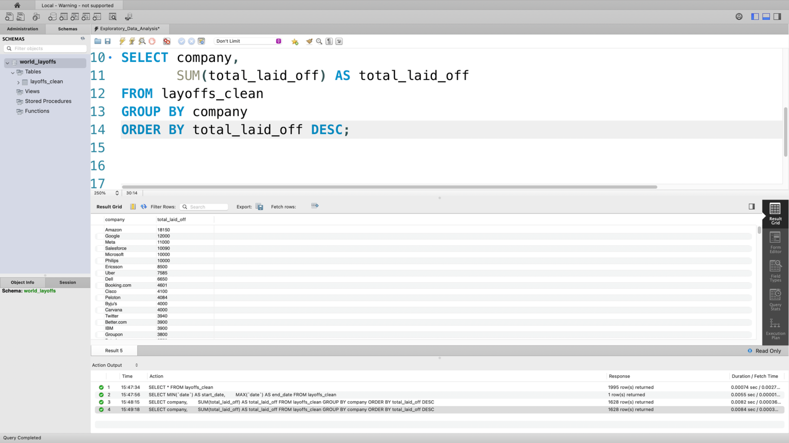
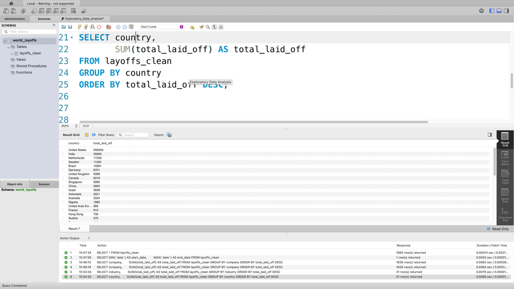
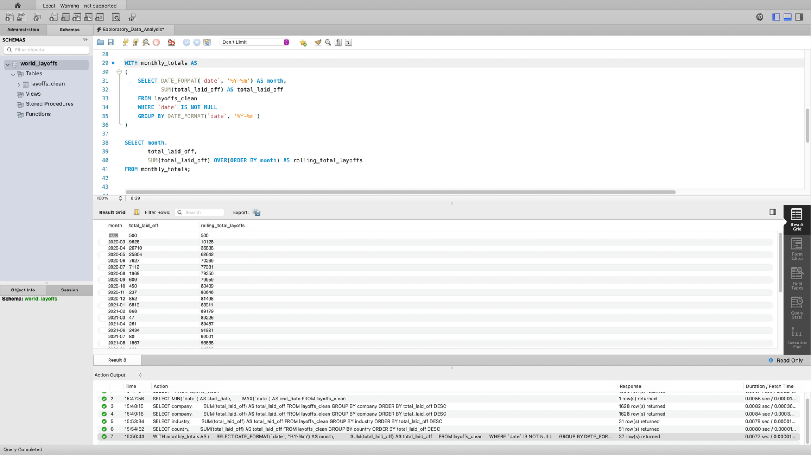
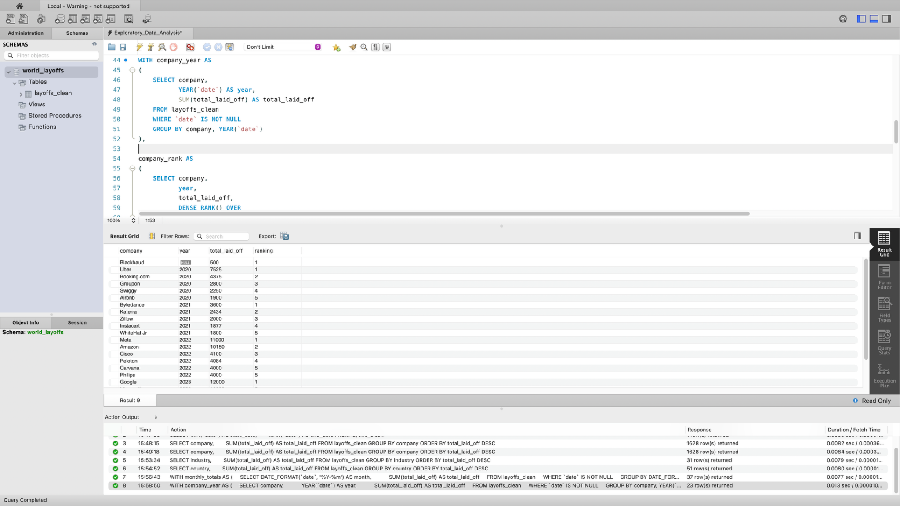

# Layoffs-Exploratory-Data-Analysis-in-MySQL
Exploratory Data Analysis in MySQL using a global layoffs dataset to identify trends, patterns, and business insights.

# Layoffs Exploratory Data Analysis in MySQL

## Project Overview

This project performs Exploratory Data Analysis (EDA) on a real-world global layoffs dataset using MySQL.

The analysis focuses on identifying trends, patterns, and business insights across companies, industries, countries, and time periods.

The dataset contains approximately 1,996 records of global company layoffs from 2020 to 2023.

---

## Objectives

- Analyse layoffs by company
- Analyse layoffs by industry
- Analyse layoffs by country
- Investigate yearly and monthly layoff trends
- Calculate rolling totals using window functions
- Rank top companies by layoffs each year

---

## Tools Used

- MySQL
- MySQL Workbench

---

## SQL Concepts Used

- Aggregate Functions
- GROUP BY
- ORDER BY
- Common Table Expressions (CTEs)
- Window Functions
- DENSE_RANK()
- Date Functions
- Data Aggregation

---

## Project Preview

### Top Companies by Total Layoffs

### Layoffs by Industry

### Layoffs by Country

### Rolling Total Layoffs

### Top Companies by Layoffs Each Year

---

## Key Findings

- Amazon recorded the highest total layoffs in the dataset.
- Consumer and Retail industries experienced the highest number of layoffs.
- The United States reported the largest number of layoffs.
- Layoffs increased significantly during 2022 and 2023.
- Several companies experienced complete workforce reductions.
- Large technology companies dominated yearly layoff rankings.

---

## Files Included

- [layoffs_clean.csv](layoffs_clean.csv) – Cleaned layoffs dataset used for analysis
- [Exploratory_Data_Analysis.sql](Exploratory_Data_Analysis.sql) – Complete SQL script containing all exploratory analysis queries

---

## Skills Demonstrated

- SQL
- Exploratory Data Analysis
- Data Aggregation
- Data Storytelling
- Window Functions
- Common Table Expressions (CTEs)
- Trend Analysis
- Business Insight Generation

---

## Conclusion

This project demonstrates how SQL can be used to transform cleaned data into meaningful business insights through exploratory data analysis.

The analysis highlights global layoff trends and showcases practical SQL techniques commonly used in data analyst roles.
